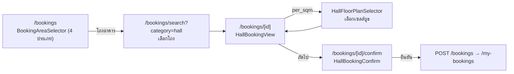

# Hall Management & Booking (โถงอาคาร)

เอกสารสรุปฟีเจอร์ **จัดการและจองพื้นที่โถง** — ครอบคลุมทั้งฝั่ง admin (จัดการโถง/ราคา/ผังพื้นที่)
และฝั่งผู้ใช้ (ยื่นขอใช้/จองพื้นที่โถงแบบเลือกบูธบนผัง) ทั้ง backend (`apps/backend`) และ frontend (`apps/frontend`)

> อัปเดตล่าสุด: 2026-07-19 · branch `feature/hall-mgmt`

---

## 1. ภาพรวม

**โถง (โถงอาคาร)** = แถวใน `locations` ที่ `type = "โถงอาคาร"` — ใช้โครง location เดิมร่วมกับห้อง/สนาม
แต่มีลักษณะเฉพาะ: **ไม่มี capacity**, จองเป็น **รายวัน (ไม่เลือกเวลา)**, คิดราคาตาม **วัตถุประสงค์**
และ **หลายคนจองคนละบูธในโถงเดียวกันวันเดียวกันได้** (แชร์ระดับเซลล์บนผัง)

ฟีเจอร์แบ่ง 2 ฝั่ง:

| ฝั่ง | ใคร | ที่อยู่ | ทำอะไร |
|---|---|---|---|
| **จัดการ (management)** | admin/staff | `features/halls/` · `/admin/manage-halls` | สร้าง/แก้โถง, ตั้งราคา (อาคาร/รายโถง), จัดการวัตถุประสงค์, วาดผังพื้นที่ + กริด + ช่องห้ามจอง |
| **จอง (booking)** | ผู้ใช้ทั่วไป | `features/bookings/` · `/bookings` | เลือกวัน → เลือกวัตถุประสงค์ → เลือกบูธบนผัง → ยืนยัน (เอกสาร + ข้อตกลง) |

---

## 2. โมเดลข้อมูล (Data model)

| Model (table) | ไฟล์ | บทบาท |
|---|---|---|
| `Locations` (type=โถงอาคาร) | `models/location.go` | โถง 1 แถว = 1 location ; ข้อมูลพื้นฐาน (ชื่อ/อาคาร/รูป/`description`) ใช้ผ่าน `locationService` เดิม |
| `HallUsagePurposes` | `models/*` | **master data วัตถุประสงค์** — `pricing_model` (`per_sqm` / `per_type_per_day`), `default_price` (fallback), `is_active`, `sort_order` |
| `BuildingHallPricings` | `models/*` | ราคาโถง **ราย (อาคาร × วัตถุประสงค์)** — `Price`, `IsActive` (เปิด/ปิดวัตถุประสงค์ต่ออาคาร), unique(building_id, purpose_id) — เป็น **ราคาขั้นต่ำ/เรทกลาง** ของทุกโถงในอาคาร |
| `LocationHallPricings` | `models/location_hall_pricing.go` | ราคา **เฉพาะโถง (ทำเลทอง)** ราย (โถง × วัตถุประสงค์) — `Price` เท่านั้น (ไม่มี IsActive) เป็น **override** ของราคาอาคาร |
| `HallFloorPlans` | `models/*` | ผังพื้นที่ 1:1 กับ location — รูป top-view (object_key), สเกล, `overlay` (กรอบกริด 0..1), `grid_cols/rows`, `cell_size_m`, `blocked_cells` (JSON) |
| `BookingPurposes` | `models/booking_purpose.go` | วัตถุประสงค์ที่เลือกตอนจอง (1 booking หลายแถว) — snapshot `pricing_model`, `selected_cells`, `area_sqm`, `product_type_count`, `unit_price_snapshot`, `computed_price`, `proposed_price`, `total_price` |
| `Timeslots` (`is_shared`) | `models/booking.go` | วัน 1 วัน = 1 timeslot ; โถงตั้ง `is_shared=true` เพื่อยกเว้นจาก partial unique index (ดู §5.1) |

---

## 3. การคิดราคา (Pricing)

### 3.1 การ resolve ราคาต่อหน่วย
ราคาต่อหน่วยของแต่ละวัตถุประสงค์คิดตามลำดับ (`services/hall_pricing.go`, `booking.go priceHallPurposes`):

1. เริ่มจาก `HallUsagePurposes.DefaultPrice` (fallback)
2. ถ้าอาคารตั้งราคาไว้ (`BuildingHallPricings`) → ใช้ `Price` ของอาคาร ; ถ้า `IsActive=false` → **ปฏิเสธ** ("อาคารนี้ไม่เปิดให้ขอใช้พื้นที่เพื่อ …")
3. ถ้าโถงตั้งราคาเฉพาะ (`LocationHallPricings`) → `resolveHallUnitPrice(floor, override) = max(floor, override)` (ราคาอาคารเป็นขั้นต่ำเสมอ)

### 3.2 สูตรราคาที่ระบบคิด (ComputedPrice)
`days` = จำนวนวันไม่ซ้ำที่จอง

| pricing_model | สูตร | หมายเหตุ |
|---|---|---|
| `per_sqm` (ตั้งบูธ) | `round(unitPrice × areaSqm × days)` | `areaSqm = จำนวนเซลล์ × cell_size_m²` (จากผัง) → เข้า **basePrice** |
| `per_type_per_day` (ใบปลิว/ตัวอย่าง) | `unitPrice × productTypeCount × days` | → เข้า **addonPrice** |

### 3.3 ราคาที่ผู้ขอเสนอ (ProposedPrice)
- ผู้ใช้ **กรอกราคาเสนอได้ (optional)** ต่อวัตถุประสงค์ — ราคาที่ใช้จริง `TotalPrice = ProposedPrice ?? ComputedPrice`
- **ต้องไม่ต่ำกว่า `ComputedPrice`** ไม่งั้น backend ปฏิเสธ (message ไม่เปิดเผยค่าเกณฑ์ตรง ๆ)
- Frontend มี **price-quote** (§4, `POST …/hall-price-quote`) ช่วยให้เห็นราคาระบบก่อนเสนอ + validate ฝั่ง client ว่าไม่ต่ำกว่าเกณฑ์ (backend ยังเป็นตัวคุมจริงเสมอ)

---

## 4. Backend — API

### 4.1 Public (หน้าจองของผู้ใช้)
| Method + Path | Handler | คืน |
|---|---|---|
| `GET /hall-usage-purposes` | `GetHallUsagePurposes` | วัตถุประสงค์ที่ `is_active` (มี `?include_inactive=true` สำหรับ mgmt) |
| `GET /locations/:id/public-floor-plan` | `GetPublicFloorPlan` | ผังโถง (reuse `GetFloorPlan`) — presigned image URL + grid + overlay + `blocked_cells` ; `null` ถ้ายังไม่มีผัง |
| `GET /locations/:id/booked-cells?dates=YYYY-MM-DD,…` | `GetBookedCells` | `[][]int` — เซลล์ที่ถูกจองแล้ว (union) จาก booking ที่ยัง active ในวันเหล่านั้น (เฉพาะ `per_sqm`, ยกเว้น cancelled/rejected) |
| `POST /locations/:id/hall-price-quote` | `QuoteHallPrice` | ราคาที่ระบบคิด (preview) ต่อวัตถุประสงค์ + total — body `{ days, purposes[] }` ; ไม่ตรวจ proposed |

### 4.2 การจอง (auth)
| Method + Path | สิทธิ์ | หมายเหตุ |
|---|---|---|
| `POST /bookings` | requester/staff/admin | ส่ง `purposes[]` = จองแบบโถง (คิดราคาจากวัตถุประสงค์, timeslot snapshot=0) |
| `PUT /bookings/:id/revise` | เจ้าของ | แก้วัตถุประสงค์ของ booking สถานะ `needs_revision` แล้วส่งใหม่ → `pending` |
| `PUT /bookings/:id/status` | staff/admin | ส่งกลับให้แก้ด้วย `status="needs_revision"` |

**payload `POST /bookings` (โถง):**
```jsonc
{
  "purpose": "ขอใช้พื้นที่โถง: …",
  "timeslots": [{ "location_id": 11, "date": "…", "start_time": "…", "end_time": "…", "is_full_day": true }],
  "purposes": [
    { "hall_usage_purpose_id": 1, "selected_cells": [[0,0],[0,1]], "proposed_price": 500 }, // per_sqm
    { "hall_usage_purpose_id": 2, "product_type_count": 3 }                                  // per_type_per_day
  ]
}
```

### 4.3 จัดการ (staff/admin — `location_mgmt`)
| Method + Path | ทำอะไร |
|---|---|
| `GET /buildings` | อาคารทั้งหมด + `hall_pricings[]` |
| `PUT /buildings/:id/hall-pricings` | ตั้งราคาโถงรายอาคาร (bulk upsert per วัตถุประสงค์ + is_active) |
| `POST /hall-usage-purposes` · `PUT /hall-usage-purposes/:id` | เพิ่ม/แก้วัตถุประสงค์ (`pricing_model` แก้ไม่ได้) |
| `GET/PUT /locations/:id/hall-pricings` | ราคาเฉพาะโถง (ทำเลทอง) — PUT `price:null` = ล้าง override ; ต่ำกว่าราคาอาคาร → 400 |
| `GET/PUT /locations/:id/floor-plan` | อ่าน/บันทึกผัง (top-view + สเกล + กริด + ช่องห้ามจอง) |
| `GET /hall-floor-plans` | location_id ที่มีผังแล้ว (โชว์ป้าย "มีผัง") |

Routes: `routes/location.go`, `routes/booking.go` · Controllers: `controllers/location.go`, `controllers/booking.go`
Services: `services/location.go`, `services/booking.go`, `services/hall_pricing.go` (pure, unit-tested)

---

## 5. Backend — การออกแบบสำคัญ

### 5.1 หลายบูธ/โถง/วันเดียวกัน — Partial unique index
`Timeslots` เดิมมี unique index `idx_timeslot_slot (location_id, date, start_time)` กันจองซ้ำ
แต่โถงต้องให้หลายคนจองวันเดียวกัน (คนละเซลล์) จึง:
- เพิ่มคอลัมน์ **`Timeslots.IsShared bool`** (โถง = `true`)
- เปลี่ยน index เป็น **partial**: `CREATE UNIQUE INDEX idx_timeslot_slot … WHERE is_shared = false` (raw SQL ใน `cmd/init-db`, ลบ gorm tag `uniqueIndex` ออกจาก model)
- ผล: การจองประเภทอื่น (ห้อง/สนาม, `is_shared=false`) **ได้ unique เดิมเป๊ะ** ; โถงยกเว้น → จองซ้ำวันได้

### 5.2 กันจองบูธทับกัน — cell overlap validation
`BookingService.Create` เมื่อเป็นโถง (`len(purposes)>0`):
- **ข้าม** `IsSlotTaken` (ใช้กับห้องเท่านั้น)
- เรียก `validateHallCellAvailability` — ปฏิเสธถ้าเซลล์ที่เลือกทับ (a) `blocked_cells` บนผัง หรือ (b) เซลล์ที่ booking อื่นจองไว้แล้วในวันเดียวกัน (`FindBookedCells`)

### 5.3 Price quote (แสดงราคาให้ผู้ใช้)
`QuoteHallPurposes` เรียก `priceHallPurposes` โดย **ตัด proposed ออก** → คืน `ComputedPrice` ล้วน โดยไม่สร้าง booking
> หมายเหตุ: เดิมตั้งใจไม่โชว์ราคาเกณฑ์ ; ภายหลังเปลี่ยนเป็น **แสดงราคาที่ระบบคิด** (UX ดีกว่า) โดย backend ยังคุมเกณฑ์ขั้นต่ำจริงเสมอ

---

## 6. Frontend — ฝั่งจัดการ (admin, `features/halls/`)

- หน้า `/admin/manage-halls` — `HallGrid` / `HallCard` + drawer สร้าง/แก้ (`HallCreateDrawer`, `HallEditDrawer`, `HallFormFields`, `HallPricingFields`)
- **ตั้งราคาโถงตามอาคาร** — `HallPricingDrawer` (+ tab จัดการวัตถุประสงค์ `HallPurposesTab`) ; ราคาเฉพาะโถง `HallPurposePricing`
- **ผังพื้นที่** — `floorplan/HallFloorPlanEditor` (อัปโหลด top-view → ลากกรอบพื้นที่ตั้งสเกล → วางกริด → ระบายช่องห้ามจอง) บันทึกลง DB ผ่าน `hallFloorPlanService`
- services: `hallService`, `hallPricingService`, `hallFloorPlanService` · hook `useHalls` · types `hall/pricing/floorplan`

> โดเมนรูล/รายละเอียดการจัดการเพิ่มเติมอยู่ที่ memory `hall-area-management` และ `hall-pricing-booking`

---

## 7. Frontend — ฝั่งผู้ใช้ (booking, `features/bookings/`)

### 7.1 Flow


หน้า `app/bookings/[roomId]/page.tsx` และ `.../confirm/page.tsx` **แตกสาขาเมื่อ `room.type === "โถงอาคาร"`** → render component โถง ไม่งั้นใช้ flow ห้องเดิม (`Room` เพิ่มฟิลด์ `type`, `buildingId` ใน `location.service`)

### 7.2 Components
| Component | บทบาท |
|---|---|
| `hooks/useHallCalendar` | ปฏิทินเลือก **เฉพาะวัน** (ไม่มีเวลา), lead time 7 วัน, `restore(dates)` กู้คืนตอนย้อนกลับ |
| `components/hall/HallBookingView` | ปฏิทิน (reuse `MonthlyCalendar`) + checkbox วัตถุประสงค์ + ปุ่มเลือกบูธ + input จำนวนประเภท + ราคาเสนอ ; ยิง quote (debounce) แสดงราคาระบบ + validate ราคาเสนอ ; เก็บ draft → ไป confirm |
| `components/hall/HallFloorPlanSelector` | โมดัลเลือกเซลล์บูธ — โหลดผัง (public) + booked-cells ตามวันที่ ; **crop รูปให้เหลือเฉพาะกรอบกริด** (overlay region) ; เซลล์: เทา=ว่าง, แดง=ถูกจอง/ห้ามจอง, ส้ม=เลือกแล้ว ; คลิก/ลากเลือก |
| `components/hall/HallBookingConfirm` | สรุป (โถง/วัน/วัตถุประสงค์/ราคาระบบ/ราคาเสนอ) + อัปโหลดเอกสาร + ข้อตกลง → `createBooking({purpose,timeslots(full-day),purposes})` |
| `services/hall.service` | `getPublicHallFloorPlan`, `getBookedCells`, `getHallPriceQuote` |

### 7.3 Draft (persist ระหว่างสลับหน้า)
- กด "ถัดไป" → เก็บ draft ใน `sessionStorage` key `hall_booking_draft_<locationId>` (วัน + วัตถุประสงค์ + เซลล์ + จำนวนประเภท + ราคาเสนอ + ราคาระบบ)
- `HallBookingConfirm` อ่าน draft ; **ลบ draft เฉพาะตอนส่งสำเร็จ**
- `HallBookingView` **กู้คืน draft ตอน mount** → ย้อนกลับจาก confirm ค่าที่เลือกยังอยู่ครบ

### 7.4 การ validate ฝั่ง client (HallBookingView)
- ≥1 วัน, ≥1 วัตถุประสงค์
- `per_sqm` ต้องเลือกเซลล์ ≥1 ; `per_type_per_day` ต้องกรอกจำนวนประเภท ≥1
- ราคาเสนอ (ถ้ากรอก) ต้องเป็นจำนวนเต็มบวก **และ ≥ ราคาระบบ** (จาก quote) — ไม่งั้นขึ้นเตือน "ต่ำกว่าเกณฑ์ที่กำหนด"

---

## 8. การรัน / migration

- **Apply schema (จำเป็น):** `cd apps/backend && go run ./cmd/init-db`
  - AutoMigrate (เพิ่มคอลัมน์ `timeslots.is_shared`) + สร้าง partial index `idx_timeslot_slot` + seeds (idempotent, DB = `mydb`)
- **Backend:** `go run ./cmd/serve` (ไม่ auto-migrate — ต้องรัน init-db ก่อนถ้าแก้ schema)
- **Tests:** `go test ./internal/services/...` (รวม `hall_pricing_test.go`)
- **Frontend:** `npm run dev` (พอร์ต 3000, ตั้ง API ที่ `NEXT_PUBLIC_API_URL`)

> หลังแก้โค้ด backend ต้อง **รีสตาร์ท serve** ไม่งั้น endpoint ใหม่จะ 404 กับ binary เก่า

---

## 9. ความพร้อม / ข้อจำกัด (by design · PENDING)

### ✅ ทำแล้ว + ทดสอบ end-to-end กับ DB จริง
- จัดการโถง/ราคา (อาคาร + ทำเลทอง)/วัตถุประสงค์/ผัง
- จองโถง: เลือกวัน → วัตถุประสงค์ → บูธบนผัง → ยืนยัน ; แชร์เซลล์หลายบูธ/วัน ; กันเซลล์ทับ ; ราคาเสนอ ≥ เกณฑ์ ; needs_revision/revise

### 📌 ข้อจำกัดที่ควรรู้
- **money เป็น `int` ชั่วคราว** (booth ปัดเศษด้วย `math.Round`) — แผนแปลงทั้งระบบเป็น `decimal(12,2)` (กระทบ payment/invoice ~5 จุด)
- **overlay ของ dialog เลือกเซลล์** ยัง z ต่ำกว่า topbar (`z-[1001]`) เล็กน้อย — content ดันขึ้นเหนือแล้วแต่ backdrop ไม่คลุม topbar (ถ้าต้องการคลุมต้องแก้ z ของ overlay ใน `components/ui/dialog` = กระทบทุก dialog)
- **`DocumentFormModal`** (สร้าง PDF) อ้างอิง timeslots แบบมีเวลา — โถงเป็น full-day (00:00–23:59) ข้อความเวลาบนเอกสารอาจต้องปรับ (polish)
- booking ที่ **cancelled/rejected คืน timeslot** เฉพาะกรณีทั่วไปยังมี behavior เดิม (`IsSlotTaken` นับ booking_id ที่ไม่ null) — โถงใช้ cell-check จึงไม่กระทบ
- การ validate ราคาเสนอฝั่ง client อาศัย quote ; **แหล่งความจริงคือ backend** เสมอ
