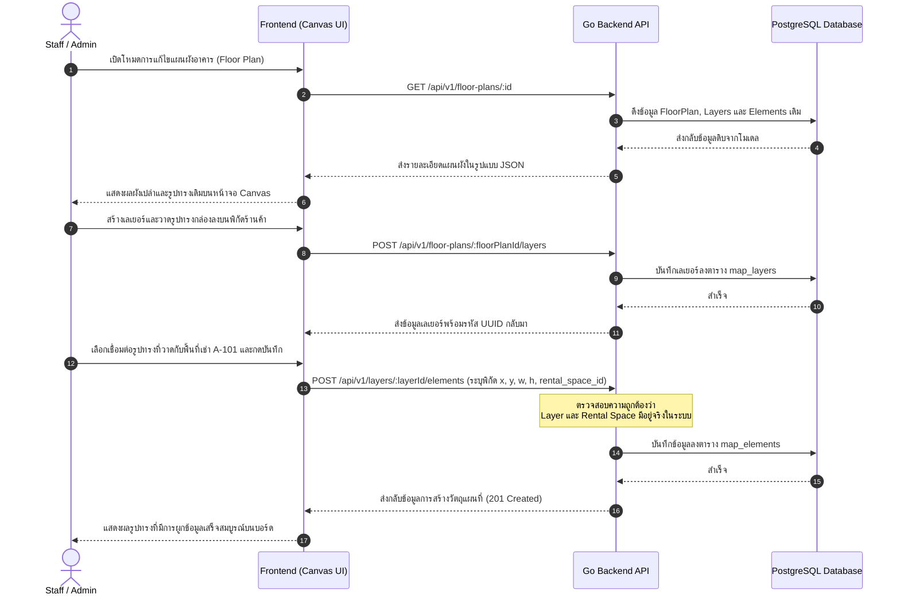

# Use Cases & Specifications: Rental Space Module

เอกสารนี้ระบุกระบวนการทำงานทางธุรกิจ (Business Workflows), แผนภาพยูสเคส (Use Case Diagrams) และสเปคการตอบสนองของระบบ (System Behavior) สำหรับผู้ดูแลและผู้เช่าพื้นที่

## คำอธิบายผู้ใช้งานระบบ (Actor Profiles)

1. **ผู้ดูแลระบบสถานที่ (Staff/Admin):**
   * มีสิทธิ์ในการสร้าง ลบ และแก้ไขแผนผังอาคาร (Floor Plans)
   * สามารถแบ่งเลเยอร์ (Map Layers) และใช้อินเตอร์เฟส Canvas วาดรูปทรงพื้นที่เช่าลงบนแผนที่ (Map Elements)
   * สามารถอัปเดตและเปลี่ยนแปลงสถานะของพื้นที่เช่าได้โดยตรง

2. **ผู้เช่า/ผู้ใช้งานทั่วไป (Tenant/User):**
   * สามารถเรียกดูแผนผังแบบโต้ตอบ (Interactive Map) บน Frontend หน้าเว็บหลัก
   * สามารถดูรายละเอียดและสถานะของแต่ละพื้นที่ในแต่ละชั้นได้แบบ Real-time (เช่น ว่าง, จองแล้ว, ปิดปรับปรุง)

---

## รายละเอียด Use Cases หลัก

### 1. UC-01: การสร้างและจัดการผังอาคาร (Manage Floor Plan Canvas)
* **Goal:** ผู้ใช้กลุ่ม Staff/Admin สามารถสร้างผังพื้นหลังและกำหนดขนาด Canvas สำหรับอาคารที่เลือก
* **Actors:** Staff/Admin
* **Pre-conditions:** อาคาร (Building) ต้องถูกบันทึกในระบบเรียบร้อยแล้ว
* **Main Flow:**
  1. Staff เลือกอาคารที่ต้องการจัดการแผนผัง
  2. ระบุชื่อแผนผัง เช่น "แผนผังชั้น 1 อาคารไอที", ขนาด Canvas (กว้าง, สูง ในหน่วยพิกเซล) และเลขชั้น (Floor Number)
  3. ระบบบันทึกข้อมูลผัง (ตาราง `floor_plans`) และส่งผลลัพธ์กลับมาเพื่อให้ Frontend เตรียมบอร์ดวาดภาพ

---

### 2. UC-02: การจัดเลเยอร์และวาดรูปพื้นที่เช่า (Layer & Element Drafting)
* **Goal:** Staff/Admin สามารถจัดการเลเยอร์ความรับผิดชอบ และลากรูปทรงต่าง ๆ เพื่อระบุตำแหน่งของร้านค้าบนแผนผัง
* **Actors:** Staff/Admin
* **Pre-conditions:** แผนผังอาคารนั้น ๆ ถูกสร้างแล้ว
* **Main Flow:**
  1. Staff เข้าสู่โหมดแก้ไขแผนผังอาคารตาม ID
  2. สร้างเลเยอร์แผนที่ใหม่ เช่น "เลเยอร์โซนบริการ", "เลเยอร์ร้านอาหาร" เพื่อความสะดวกในการแยกปิด/เปิดการมองเห็น
  3. เลือกเครื่องมือวาดรูปทรง (เช่น สี่เหลี่ยม) บน Canvas
  4. ทำการวาดรูปทรงระบุพิกัด X, Y, ขนาด กว้าง, สูง และองศาการหมุน (Rotation)
  5. เลือกพื้นที่เช่า (Rental Space) ที่ต้องการนำมาผูกคู่กับรูปทรงนี้ (ถ้ามี)
  6. กดบันทึกข้อมูลเพื่อส่งไปสร้างวัตถุแผนที่ (ตาราง `map_elements`)

---

### 3. UC-03: การจัดการข้อมูลพื้นที่เช่าทางกายภาพ (Manage Rental Space Info)
* **Goal:** Staff/Admin สามารถจัดการข้อมูลรายการพื้นที่ทางกายภาพ เช่น ราคาขั้นต่ำ ขนาดพื้นที่ และสถานะการเปิดให้เช่า
* **Actors:** Staff/Admin
* **Pre-conditions:** ไม่มี
* **Main Flow:**
  1. Staff ทำการลงทะเบียนหรือแก้ไขพื้นที่เช่าระบุรหัสโซน (Area Code เช่น "A-101"), ชื่อห้อง, และราคาเช่าเริ่มต้น
  2. กำหนดสถานะตั้งต้น เช่น `'available'` (ว่างพร้อมให้เช่า) หรือ `'maintenance'` (ปิดปรับปรุง)
  3. อัปโหลดภาพถ่ายแนบเข้าระบบ (ตาราง `rental_space_images`)
  4. บันทึกข้อมูลเพื่อแสดงรายการในตารางระบบ

---

### 4. UC-04: การดูแผนผังแบบโต้ตอบและการจองพื้นที่ (Interactive Map Viewer)
* **Goal:** ผู้ใช้งานทั่วไปสามารถดูแผนผังและตรวจสอบว่าร้านค้าใดว่างอยู่ เพื่อทำการสมัครจองพื้นที่
* **Actors:** Tenant/User
* **Pre-conditions:** แผนผังอาคาร เลเยอร์ และวัตถุแผนที่ต้องถูกจัดเตรียมและผูกคู่กันเสร็จเรียบร้อยแล้ว
* **Main Flow:**
  1. ผู้ใช้งานทั่วไปเข้ามาที่หน้าแสดงผังโครงการของอาคาร
  2. ระบบดึงข้อมูลแผนผังพร้อมโหลดเลเยอร์และวัตถุแบบซ้อนกัน (Nested)
  3. ผู้ใช้ชี้เมาส์ (Hover) ไปยังวัตถุรูปทรงร้านค้าต่าง ๆ หน้าจอจะแสดงสถานะและราคาของพื้นที่เช่าที่ผูกคู่กันแบบ Real-time
  4. ผู้ใช้กดเลือกพื้นที่ว่างที่สนใจและเข้าสู่หน้าจอการสมัครเช่าพื้นที่ต่อไป

---

## ลำดับขั้นตอนการทำงาน (User Flow Diagram)

แผนภาพแสดงขั้นตอนการทำงานตามลำดับเวลา (Sequence Flow) ในการสร้างเลเยอร์และการวาดบันทึกรูปทรงวัตถุร้านค้าลงบน Canvas ของโมดูล Rental Space:

